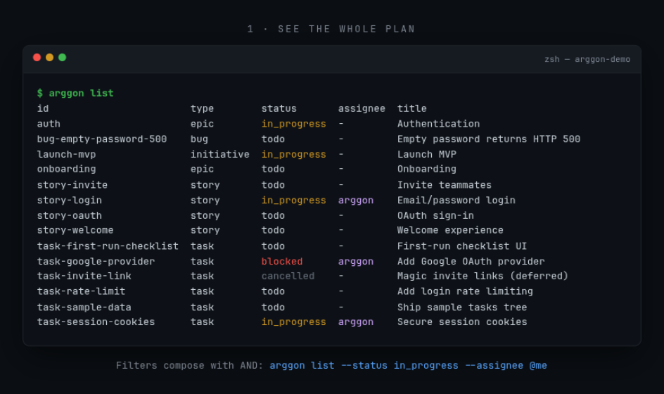

# ArggonManager

**Git-native project management for builders and agents.**

Tasks live _inside_ the repository as Markdown. Create a file, open a branch, update YAML — the whole team (and any agent) stays in sync. No separate board to drift out of date.

> **Status:** early design — convention + CLI first.

## Demo

A 30-second tour — list, claim, create, finish, validate, board (autoplay below; also available as [MP4](docs/assets/arggon-demo.mp4)):


**`arggon list`** — the whole plan, right from the repo:



**`arggon create` / `arggon update`** — claim and move work by editing files:


**`arggon update --status done` + `arggon validate`** — finish work and verify the tree (CI-ready):


**`arggon board`** — a static, self-contained HTML snapshot of the same tree:


## The idea

Work is a **folder tree** that mirrors Agile structure:

```text
tasks/
  <initiative>/
    <epic>/
      <story>/
        task-....md
        bug-....md
```

Each item is a Markdown file with **YAML frontmatter** (status and other fields). Updating work means editing the file and committing — same flow for developers, QA, and agents.

**Convention (v0) is locked.** See [`docs/convention.md`](docs/convention.md) for folder layout, frontmatter schema, statuses, and claim rules. A sample tree lives under [`tasks/launch-mvp/`](tasks/launch-mvp/) (plus [`tasks/.convention.yml`](tasks/.convention.yml)). Copy-paste templates for each type live in [`templates/`](templates/).

## Who it’s for

- Builders who want tasks next to the code
- Teams that share work through git, not a SaaS board
- Agents that should pick up and create tasks like humans

## Principles

1. **Repo is source of truth** — if it’s not in git, it isn’t the plan
2. **Files over forms** — an `.md` is the ticket
3. **Same rules for humans and agents**
4. **Simple & self-hostable** — open, lightweight, no lock-in

## What’s shipping (phased)

| Phase | Deliverable                                       |
| ----- | ------------------------------------------------- |
| **1** | Folder + frontmatter **convention** and templates |
| **1** | **CLI** to create, list, and update tasks         |
| **2** | Viewer / board UI over the tree                   |
| **3** | Agent hooks / SDK so agents follow the same rules |

## Example task file

```markdown
---
type: task
status: todo
id: task-rate-limit
parent: story-login
labels: [security]
created: "2026-09-03"
updated: "2026-09-03"
---

# Add login rate limiting

## Context

...

## Acceptance

- [ ] ...
```

Exact v0 fields are documented in [`docs/convention.md`](docs/convention.md) (layout, schema, and status transitions are locked). Omit `assignee` when unassigned (do not write an empty `assignee:`).

## Docs

- [Task convention](docs/convention.md) — folder layout, frontmatter schema, statuses (v0 locked)
- [Agent playbook](docs/agents.md) — find, claim, create, PR loop for humans and agents
- [Claim / concurrency](docs/claim.md) — claim definition, conflict/`--force`, unclaim recovery
- [Engineering conventions](docs/engineering.md) — repo structure, review bar, testing, ADRs (Phase 1)
- [Phase 2 viewer spike](docs/viewer-spike.md) — proposed constraints for board/viewer over `tasks/` (towards #19; not an ADR)
- Sample tree: [`tasks/launch-mvp/`](tasks/launch-mvp/)

## Templates

v0 stubs (YAML frontmatter + Context / Acceptance / Notes) live in [`templates/`](templates/):

- [`templates/initiative.md`](templates/initiative.md)
- [`templates/epic.md`](templates/epic.md)
- [`templates/story.md`](templates/story.md)
- [`templates/task.md`](templates/task.md)
- [`templates/bug.md`](templates/bug.md)

Copy a stub into `tasks/` per [`docs/convention.md`](docs/convention.md), or use `arggon create` (copies from these templates).

## CLI (Phase 1)

Requires **Node.js 20+**. Stack: [docs/adr/0001-cli-stack.md](docs/adr/0001-cli-stack.md) (ADR 0001 Accepted with this scaffold).

Root install; TypeScript in cli/:

```bash
npm install
npm run arggon -- hello
npm run arggon -- init /path/to/repo
npm run arggon -- list
npm run arggon -- validate
npm run build
npm test
npm run lint
```

`arggon init` creates `tasks/.convention.yml` and copies `templates/` (no overwrite unless --force; already-initialized repos are a no-op).

### `arggon list`

Finds `tasks/` with walk-up from cwd (same as `create`), loads work items with the shared kernel, and prints a table (or `--json`). Listing order is lexicographic by `id`. Filters compose with AND.

```bash
arggon list
arggon list --status todo
arggon list --type bug --assignee @me
arggon list --json
arggon --json list --type task --status in_progress
```

- --status <status>: exact v0 status (`todo`, `in_progress`, `blocked`, `done`, `cancelled`)
- --type <type>: exact v0 type (`initiative`, `epic`, `story`, `task`, `bug`)
- --assignee <login>: exact assignee. Special @me resolves via `GITHUB_USER`, then `GITHUB_ACTOR`, then `gh api user -q .login`
- --json: one compact JSON object on stdout (envelope v1: `ok`, `schemaVersion: 1`, `conventionVersion`, `command: "list"`, `items: WorkItem[]`); failures emit `ok: false` with `code: "LIST_FAILED"`

Empty results exit `0` (`items: []` with `--json`). Missing `tasks/`, invalid enums, unresolvable @me, or unreadable work-item files exit non-zero.

`arggon create <type> <title>` writes a work item under `tasks/` from the templates. Non-initiative types need `--parent <id>`. Defaults: `status: todo`, `created`/`updated` today. Flags: `--id`, `--assignee`, `--status` (not `done`), `--blocked-reason`.

`arggon update <id>` edits frontmatter in place (only requested fields). Enforces v0 status transitions, the claim rule (`in_progress` on story/task/bug needs `--assignee`), and `blocked_reason` rules; always touches `updated`. Transitions `in_progress` → `todo` clear `assignee` by default (override with explicit `--assignee`); leaving `blocked` clears `blocked_reason`. Reassigning a claimed item fails with a claim conflict unless `--force` (see [docs/claim.md](docs/claim.md)). Flags: `--title`, `--status`, `--assignee`, `--unassign`, `--labels <csv>` (replace), `--blocked-reason`, `--force`, `--json` (envelope v1 `{ item }`, failures `UPDATE_FAILED`).

Shared kernel: `cli/src/paths.ts`, `frontmatter.ts`, `ids.ts`, `status.ts`, `items.ts`, `relations.ts`, `dates.ts`.

### `arggon validate`

Checks `tasks/` frontmatter and tree integrity (schema, parents, naming, claim/blocked rules). Uses the shared items soft-scan (`walkTasksTree` / `softTryLoadItem`) so broken YAML still reports a file path. Exits non-zero when there are errors; warnings alone stay exit 0. Suitable for CI before commit.

```bash
arggon validate
arggon validate --json
npm run arggon -- validate
```

- `--json`: v1 envelope with `errors` / `warnings` (and `VALIDATE_FAILED` when failed)

Validate: `arggon validate` / `arggon validate --json` (CI gate; docs/json-output.md).

### `arggon board`

Writes a static, self-contained read-only HTML board (columns = v0 statuses; cards show type, id, title, assignee, labels, parent, `blocked_reason`) from the same kernel read path as `list`. No server, no client JS, no writes to `tasks/` — the output is a generated snapshot; git files remain the source of truth. Stack decision: [docs/adr/0002-board-viewer-v0.md](docs/adr/0002-board-viewer-v0.md).

```bash
arggon board                  # writes board.html in cwd
arggon board --out report/board.html
arggon board --json           # v1 envelope: { path, itemCount }
```

- `--out <file>`: output path (default `board.html`); parent directories must exist
- `--json`: one JSON object on stdout; failures emit `code: "BOARD_FAILED"`

The board is a snapshot: re-run after tree changes to refresh. The generated file is a build artifact — safe to gitignore; deleting it loses nothing.

Fixtures: [fixtures/](fixtures/).

## Contributing

Ideas on folder layout, frontmatter schema, and CLI UX are especially useful right now. Open an issue. Please follow the [task convention](docs/convention.md) when proposing sample trees or templates.

## License

MIT — see [LICENSE](LICENSE).

---

Built in the open by [Arggon](https://github.com/Arggon).
