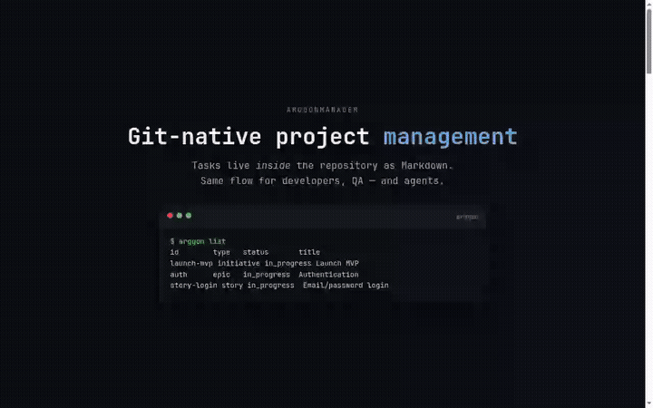
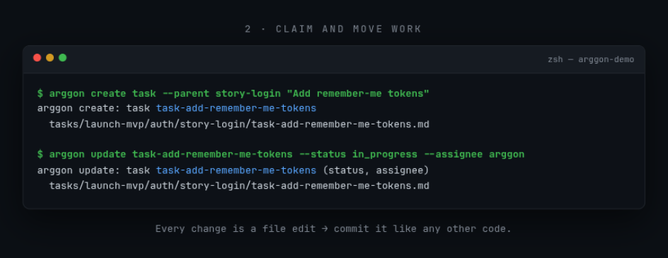
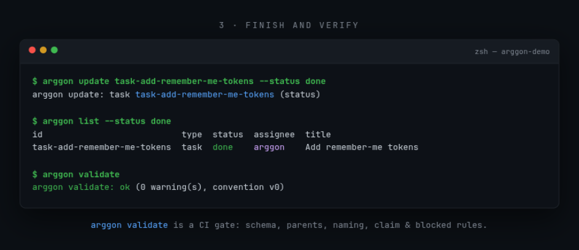
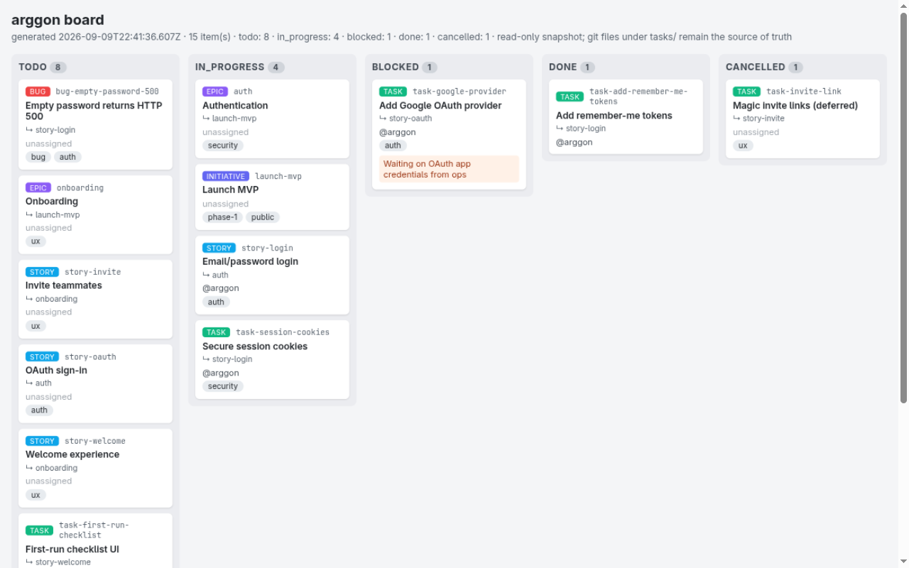

# ArggonManager

**Git-native project management for builders and agents.**

Tasks live _inside_ the repository as Markdown. Create a file, open a branch, update YAML — the whole team (and any agent) stays in sync. No separate board to drift out of date.

> **Status:** early design — convention + CLI first.

## Demo

A 30-second tour — list, claim, create, finish, validate, board (autoplay below; also available as [MP4](ArggonManager/docs/assets/arggon-demo.mp4)):



**`arggon list`** — the whole plan, right from the repo:


**`arggon create` / `arggon update`** — claim and move work by editing files:



**`arggon update --status done` + `arggon validate`** — finish work and verify the tree (CI-ready):



**`arggon board`** — a static, self-contained HTML snapshot of the same tree:



## The idea

Work is a **folder tree** that mirrors Agile structure:

```text
ArggonManager/               # tracker root (legacy: tasks/)
  <initiative>/
    <epic>/
      <story>/
        task-....md
        bug-....md
  docs/                       # product docs (convention, engineering, ADRs, specs, plans, ...)
```

Each item is a Markdown file with **YAML frontmatter** (status and other fields). Updating work means editing the file and committing — same flow for developers, QA, and agents.

**Convention (v0) is locked.** See [`ArggonManager/docs/convention.md`](ArggonManager/docs/convention.md) for folder layout, frontmatter schema, statuses, and claim rules. A sample tree lives in the fixture [`fixtures/tasks-valid/tasks/launch-mvp/`](fixtures/tasks-valid/tasks/launch-mvp/) (plus its tracker `.convention.yml`). Copy-paste templates for each type live in [`templates/`](templates/).

## Who it’s for

- Builders who want tasks next to the code
- Teams that share work through git, not a SaaS board
- Agents that should pick up and create tasks like humans

## Principles

1. **Repo is source of truth** — if it’s not in git, it isn’t the plan
2. **Files over forms** — an `.md` is the ticket
3. **Same rules for humans and agents**
4. **Simple & self-hostable** — open, lightweight, no lock-in

## Why ArggonManager

Upgrades are safe by construction. Every doc the tool generates is adopter-owned the moment it exists and is never overwritten: re-running `arggon init` silently refreshes the docs you haven't touched, skips the ones you've modified and reports them, and `--backup` archives a modified doc before regenerating it. Your customization survives every tool upgrade.

## What’s shipping (phased)

| Phase | Deliverable                                       |
| ----- | ------------------------------------------------- |
| **1** | Folder + frontmatter **convention** and templates |
| **1** | **CLI** to create, list, and update tasks         |
| **2** | Viewer / board UI over the tree                   |
| **3** | Agent hooks / SDK so agents follow the same rules |

## Example task file

```markdown
---
type: task
status: todo
id: task-rate-limit
parent: story-login
labels: [security]
created: "2026-09-03"
updated: "2026-09-03"
---

# Add login rate limiting

## Context

...

## Acceptance

- [ ] ...
```

Exact v0 fields are documented in [`ArggonManager/docs/convention.md`](ArggonManager/docs/convention.md) (layout, schema, and status transitions are locked). Omit `assignee` when unassigned (do not write an empty `assignee:`).

## Docs

- [Task convention](ArggonManager/docs/convention.md) — folder layout, frontmatter schema, statuses (v0 locked)
- [Agent playbook](ArggonManager/docs/agents.md) — find, claim, create, PR loop for humans and agents
- [OpenCode V2 playbook](ArggonManager/docs/playbooks/opencode.md) — V2 setup, conventions, testing and upgrade policy (pinned 2.0.10)
- [OpenCode2 native integration](ArggonManager/docs/opencode2.md) — what the `opencode2` branch adds, how to adopt it, and the guarantees
- [Claim / concurrency](ArggonManager/docs/claim.md) — claim definition, conflict/`--force`, unclaim recovery
- [Engineering conventions](ArggonManager/docs/engineering.md) — repo structure, review bar, testing, ADRs (Phase 1)
- [Phase 2 viewer spike](ArggonManager/docs/viewer-spike.md) — proposed constraints for board/viewer over the tracker (towards #19; not an ADR)
- Sample tree: [`fixtures/tasks-valid/tasks/launch-mvp/`](fixtures/tasks-valid/tasks/launch-mvp/)

## Templates

v0 stubs (YAML frontmatter + Context / Acceptance / Notes) live in [`templates/`](templates/):

- [`templates/initiative.md`](templates/initiative.md)
- [`templates/epic.md`](templates/epic.md)
- [`templates/story.md`](templates/story.md)
- [`templates/task.md`](templates/task.md)
- [`templates/bug.md`](templates/bug.md)
- [`templates/spec.md`](templates/spec.md) / [`templates/plan.md`](templates/plan.md) (rendered by `arggon spec new`)

Copy a stub into the tracker root (`ArggonManager/`) per [`ArggonManager/docs/convention.md`](ArggonManager/docs/convention.md), or use `arggon create` (copies from these templates). Spec/plan stubs are rendered into `ArggonManager/docs/specs/` / `ArggonManager/docs/plans/` by `arggon spec new` (see below).

## Install

Requires **Node.js 22.12+** (`engines` enforces it). The package is not published to npm; build it from a checkout and install the tarball — no pre-build step needed:

```bash
git clone https://github.com/Arggon/ArggonManager
cd ArggonManager
npm install                                   # deps; prepare builds dist/
npm pack                                      # -> arggon-manager-<version>.tgz
npm install -g ./arggon-manager-<version>.tgz
arggon --version
```

The tarball ships production `dist/`, the `templates/`, `skills/` and `opencode/` assets `arggon init` reads, README and LICENSE. Installing it needs no scripts; npm may still warn that the tarball's blocked `prepare` was skipped — benign, the build is already inside the tarball.

A checkout installs directly in this order: `npm install` first (its root `prepare` builds `dist/`), then `npm link` or `npm install -g .`. With npm 12 install scripts run only when approved, so linking an *unbuilt* checkout exits 0 without a `dist/` or a bin — build first, or approve the script by its resolved identity (`npm install -g . --allow-scripts=file:$PWD`).

The bin is `dist/cli.js` and the build sets its executable bit, so a plain `ln -s <checkout>/dist/cli.js ~/.local/bin/arggon` also works (a manual symlink used to fail with `Permission denied`).

`arggon --version` prints the package version plus the build's git sha and branch when one can be determined — `0.3.0 (abc1234, opencode2)` from a checkout, the recorded build metadata after installation, or the bare version when there is no git — so parallel installs of different branches stay distinguishable. Running `main` and `opencode2` side by side is documented in [ArggonManager/docs/opencode2.md](ArggonManager/docs/opencode2.md).

## CLI (Phase 1)

Requires **Node.js 22.12+** (needed by vitest 5 in the dev toolchain; `engines` enforces it). Stack: [ArggonManager/docs/adr/0001-cli-stack.md](ArggonManager/docs/adr/0001-cli-stack.md) (ADR 0001 Accepted with this scaffold).

Root install; TypeScript in cli/:

```bash
npm install
npm run skills:sync   # regenerate the gitignored .agents/skills/arggon-cli/SKILL.md copy
npm run arggon -- hello
npm run arggon -- init /path/to/repo
npm run arggon -- list
npm run arggon -- validate
npm run build
npm test
npm run lint
```

The SKILL command reference is generated, not hand-written: the `arggon <cmd> ...` lines inside the `arggon:generated-commands` marker regions of `skills/arggon-cli/SKILL.md` are rendered from the live commander definitions in `cli/src/cli.ts` — run `npm run skills:sync` after any command/flag/description change (`cli/src/skill-generated-commands.test.ts` fails on drift). Curated narrative stays outside the regions; a coverage invariant in the same test file fails when any non-excluded command lacks a generated-region line, so description edits always feed a region mechanically.

After a fresh clone, `.agents/skills/arggon-cli/SKILL.md` is absent (it is generated from the single source `skills/arggon-cli/SKILL.md`, not committed): run `npm run skills:sync` so agent clients that read skills from disk can see it (`npm test` regenerates it too — even when a local copy exists but is stale, so a stale copy can never fail the suite).

`arggon init` creates `ArggonManager/.convention.yml`, copies `templates/`, and generates the governing document set from master templates in `templates/docs/`. Adopter-owned content is never overwritten (not even with `--force`); on already-initialized repos init is an idempotent upgrade — see [Re-running init](#re-running-init-provenance-and-safe-regeneration) below. In a git tree init auto-commits the files it wrote (one `chore(tasks): generated init docs (N files)` commit, surgical staging — `--no-commit` opts out); paths matched by `.gitignore` (e.g. generated bundles an adopter ignores by design) are skipped and listed in the additive `commit.ignored` array instead of aborting the commit, so a fresh init leaves a clean tree and `arggon start` is never blocked by untracked tool-generated state.

Generated docs (placeholders `{{YEAR}}` and `{{PROJECT_NAME}}` are rendered at write time; `{{PROJECT_NAME}}` comes from the target dir name on a **fresh scaffold**, and on every re-run it is **recovered** — first from `x-generated.projectName` in `ArggonManager/.convention.yml`, then from the existing generated docs' content — so worktrees and renamed clones render identically to the primary checkout; when the name cannot be recovered, name-bearing writes/comparisons are skipped with a `project-name-unrecoverable` reason instead of guessing):

- **Default (tier-1):** `AGENTS.md` (spec-compliant agent workflow; mandates the bundled **arggon-cli skill** by default), `CLAUDE.md` (one-line `@AGENTS.md` shim), `.github/copilot-instructions.md` (pointer), `CONTRIBUTING.md`, `SECURITY.md`, `.editorconfig`, `.mcp.json` (registers the arggon MCP server so MCP clients pick it up), the **OpenCode V2 seam** — `opencode.jsonc` (generated only when the repo has no OpenCode config of its own), `.opencode/agents/arggon-coordinator.md` + `arggon-worker.md` + `arggon-reviewer.md`, and `.opencode/commands/arggon-next|start|done|handoff|review|status|spec|adr|explore|playbook.md`, and the optional `.opencode/plugins/arggon/index.ts` (auto-discovered; MCP auto-registration + session item context, never clobbering a configured server) — `.github/CODEOWNERS` (placeholder), `.github/PULL_REQUEST_TEMPLATE.md`, `ArggonManager/docs/tracking.md` (work tracking in the tracker, not GitHub issues), and the **arggon-cli skill** bundle at `.agents/skills/arggon-cli/` (umbrella `SKILL.md` + `references/{json-contract,methodology,orchestration,pitfalls}.md`, read on demand; copied from this repo's `skills/arggon-cli/` — single source, never a duplicate).
- **`--full` adds (tier-2):** `ARCHITECTURE.md`, `ArggonManager/docs/convention.md` + `ArggonManager/docs/engineering.md` (adopter-owned project templates), `CHANGELOG.md`, `SUPPORT.md`, `ArggonManager/docs/runbooks/README.md`, `ArggonManager/docs/deploy.md` (per-shape deployment defaults from ADR 0005: target, dated cost, config-in-repo sketch, exit note).

Everything created is listed in `created[]`; files left untouched land in `skipped[]` (see [`docs/json-output.md`](ArggonManager/docs/json-output.md)). JSON/JSONC destinations (`.mcp.json`, `opencode.jsonc`) ship as pure JSON without the `arggon:generated` HTML comment — MCP clients and OpenCode parse them directly — and OpenCode Markdown artifacts (`.opencode/**/*.md`) carry it as a `#` YAML comment inside their frontmatter so the file stays frontmatter-first. Provenance is tracked either way via the `x-generated` checksum.

#### Re-running init: provenance and safe regeneration

Every generated file carries a visible provenance marker — an HTML comment first line (`<!-- arggon:generated template="..." -->`), or a `#` YAML comment inside the frontmatter for OpenCode agents/commands (JSON/JSONC destinations carry none) — and the generation state is recorded in `ArggonManager/.convention.yml` under the namespaced `x-generated:` section (destination path → `{ template, checksum, arggonVersion, generatedAt }`; the checksum is the sha256 of the file as written, marker included). Re-running `arggon init` upgrades templates safely, Copier/Helm-style, per destination:

- **Not on disk** → generated as today (`created[]`).
- **Acknowledged via `arggon adopt --ack`** (`acknowledged: true` in the state) → skip, never regenerated: the acked content is the adopter's sanctioned baseline — **it is yours**.
- **On disk, checksum matches the recorded one** → generated-and-untouched: silently regenerated from the current template and the state refreshed (`updated[]`). This is how template improvements reach an adopted repo.
- **On disk, checksum differs (or no state entry — pre-provenance files)** → adopter-modified: **skipped** by default (`modified[]` + `skipped[]`; never overwritten, not even with `--force`). With `--backup`, the modified file is first moved to `backup/<YYYY-MM-DD>/<dest>` and then regenerated with fresh state (`backedUp[]`).

The arggon-cli skill bundle (`.agents/skills/arggon-cli/SKILL.md`) follows exactly the same rules. Hand edits keep the marker (harmless) but the checksum betrays the edit. `arggon validate` accepts the `x-generated` section (namespaced extension, ignore-unknown).

**Line endings: CRLF working trees are supported (bug-crlf-provenance-breakage).** Generated docs are always written with LF bytes; a `.gitattributes` like `* text=auto eol=crlf` in your repo may smudge them to CRLF on checkout, and that is fine: every provenance comparison — the `x-generated` checksum match, doctor's untouched/modified/acknowledged/acknowledgedDrifted buckets and its outdated render-vs-disk compare, `init --propose`'s divergence decision and diffs, and `{{PROJECT_NAME}}` recovery — normalizes `\r\n`/`\r` to `\n` at compare time, in both directions (LF-recorded state on a CRLF tree, and an `--ack` recorded over CRLF bytes compared from an LF checkout). Checksums are still recorded over the bytes as generated/acked, and your files are never rewritten to change EOLs — so an `eol=crlf` working tree reports the same doctor buckets and proposals as the LF primary checkout. Regeneration keeps writing LF; the tolerant compares absorb whatever git smudges back, so it never re-breaks checksums.

**Preview first: `arggon init --dry-run` (task-init-dry-run-plan).** Before committing to an upgrade, `--dry-run` computes the exact same per-destination decisions a real run would make — without writing anything: no files, no `backup/` dir, no auto-commit, no state mutation (a pure read; even the git tree stays untouched). It combines with `--force` / `--full` / `--backup` so the plan reflects the real invocation. Human output renders the plan as a decision table with a `nothing was written (dry run)` footer; with `--json` the usual init envelope gains `dryRun: true` and a `plan[]` array (per destination: `decision` — `created` | `updated` | `modified-skip` | `modified-backup` | `acked-skip` | `stale` | `overwritten` — plus `reason`, see [`docs/json-output.md`](ArggonManager/docs/json-output.md)). Because the plan and a real run share one decision implementation, the plan's buckets map 1:1 onto what the real run then reports:

```bash
arggon init . --dry-run --full --backup   # what would this upgrade do?
arggon init . --dry-run --json            # same plan for agents
arggon init . --full --backup             # then apply it
```

**Upgrading acked/modified docs: `arggon init --propose` (task-init-propose-acked-updates).** The skip rules above mean a fully-adopted repo — every doc acked via `arggon adopt --ack` — receives zero template updates by mechanism ("it is yours"). `--propose` is the safe upgrade channel for exactly those docs: for every acked OR adopter-modified destination whose CURRENT template render differs from what is on disk, init writes the fresh render to a side file next to the original (`<dest>.proposed-<arggonVersion>`, e.g. `ArggonManager/docs/agents.md.proposed-0.2.0`). Originals are byte-untouched, the `x-generated` state is never mutated, and nothing is committed — proposals are untracked working files (add `*.proposed-*` to `.gitignore` if you do not want to commit them). Each proposal carries a header comment above the generated marker (`<!-- arggon:proposed-update dest="..." version="..." generated="..."; diff against the original, merge what you want, then re-ack via arggon adopt --ack and delete this file -->`) so an agent reading only the proposal file knows the flow.

**Section-level backports are the default (spec-propose-section-backports-007).** A whole-file render swap is a regression for a completed doc: it replaces curated content with a generic skeleton. So for every destination whose as-generated baseline is recoverable from git history (the dest's FIRST committed version — init auto-commits what it writes — is exactly what the old template rendered), `--propose` diffs that baseline against the current template render and proposes only the regions the template ADDED or CHANGED: one side file per dest, one delimited block per region, each quoting unchanged surrounding text (anchor-before/anchor-after) so the adopting agent can locate the insertion point in THEIR file. A removed-only diff (the template lost content the adopter has) is never proposed as a deletion — it is reported as `informational` and nothing is written. `--propose-whole-file` forces the old whole-render side files; whole-file is also the automatic fallback when the baseline cannot be recovered (no git history, untracked dest).

The full loop: **propose → diff/merge → re-ack** — run `arggon init . --propose`, the adopting agent diffs each side file against its original and merges what it wants as a normal work item, then refreshes the ack (`arggon adopt --ack`) and deletes the proposal file. Re-running `--propose` is idempotent: it overwrites its own same-version proposal (never accumulates `<dest>.proposed-<same-version>` junk); a destination that now matches upstream gets its same-version leftover removed and reported as `absorbed`; a proposal from a different (older) arggon version left behind is reported as `stale` and never silently deleted. Combine with `--full` to include tier-2 docs; `--dry-run --propose` lists what would be written/removed without touching anything; `--backup`/`--force` do not combine with `--propose` (proposals never touch originals or regenerate — that is a clear error). With `--json`, the init envelope gains an additive `proposals[]` array (`{ dest, proposalPath, decision: proposed | absorbed | stale | informational, template, basedOnVersion, added?, removed?, mode?: sections | whole-file, regions?: [{ kind, added, removed }], note? }`); human output lists each proposal with its mode and `+added/-removed` line summary (section mode lists every region). Pilot: ArggonStores-am's 14 acked docs.

```bash
arggon init . --propose --dry-run         # which docs would get proposals?
arggon init . --propose                   # write <dest>.proposed-<version> side files
# ... agent diffs/merges each proposal as a work item ...
arggon adopt --ack                        # re-ack the merged docs; delete the .proposed-* files
```

### `arggon doctor`

Report-only installation check (exit 0, pure read): is ArggonManager installed here, and in what shape?

```bash
arggon doctor
arggon doctor --json
arggon doctor --json --budget
```

- `initialized`: whether `ArggonManager/.convention.yml` was found, plus the convention version (0-5).
- `docs`: generated-doc provenance counts from `x-generated` — `managed` (tracked destinations), `untouched` (checksum matches), `modified` (checksum differs), `acknowledged` (sanctioned-diverged baselines from `adopt --ack`), `acknowledgedDrifted` (acknowledged docs whose current checksum differs from the acked baseline — a hand edit after the ack; informational, still adopter-owned), `stale` (template no longer generated), `missing` (tracked but absent), `outdated` (the CURRENT template render differs from the on-disk content — task-doctor-outdated-bucket, additive: upstream template improvements are not reaching the doc, regardless of local state; `docs.outdatedDocs` lists the affected destinations). Human output adds a hint line ("N doc(s) have newer templates — run `arggon init --dry-run` for the plan") when any doc is outdated. The outdated check is pure read (re-render, compare, never write) and graceful: a template that is absent or unreadable is never counted outdated (it is `stale` when no longer generated).
- `tracker`: cheap tracker sanity — total work items and `todo` count.
- `budget` (only with `--budget`, task-adr0006-remeasure): re-measures the ADR 0006 agent-facing context budgets with the 2026-09-14 baseline method — a fresh `init --full` in a throwaway temp tree (always deleted), a deterministic 8-item fixture for `list --json` (compact AND `--full`) and `show --json` payload bytes, the generated AGENTS.md bytes against its <=2048 B budget, and the live MCP `tools/list` payload against its advisory <=12,288 B budget (task-schema-budget). Report-only; see `ArggonManager/docs/json-output.md` §`doctor`.

Non-initialized repos report `initialized: false` with zeroed counts (no crash, still exit 0); failures use `error.code: "DOCTOR_FAILED"` only for unexpected errors.

### `arggon adopt`

Agent-assisted adoption for existing repos (run **after** `arggon init`): turns "start using ArggonManager here" into a tracked, agent-executable migration task instead of a half-finished doc sweep.

```bash
arggon adopt                      # files task-adopt-arggon with the migration checklist
arggon adopt --dry-run            # print the inventory + planned actions, write nothing
arggon adopt --story story-onboarding
arggon adopt --ack                # acknowledge the current generated docs as the new checksum baseline
arggon adopt --json               # v1 envelope: { taskId, storyId, storyCreated, createdContainers, taskCreated, skipped, taskPath, inventory, dryRun }
arggon adopt --ack --json         # v1 envelope: { acked: [{ path, checksum }], count }
```

- Pre-flight: requires an initialized tree (same detection as `arggon doctor`); otherwise fails with `ADOPT_FAILED` ("not an arggon-managed tree — run `arggon init` first").
- Inventory (read-only): every governing doc at the standard destinations — `AGENTS.md`, `CLAUDE.md`, `CONTRIBUTING.md`, `SECURITY.md`, `.editorconfig`, `ARCHITECTURE.md`, the `.github` files, `ArggonManager/docs/convention.md`, `ArggonManager/docs/engineering.md`, `ArggonManager/docs/runbooks/`, `README.md` — plus common alternates (`.cursorrules`, `ArggonManager/docs/index.md`, CONTRIBUTING variants). Each entry records `exists`, `bytes`, and `managed` (true when an `x-generated` provenance entry exists — arggon-generated; an existing file without one is adopter-owned, i.e. content to extract). Cheap stack hints: presence of `package.json` / `requirements.txt` / `go.mod` / `Cargo.toml` / `pom.xml` (filenames only).
- Task: `task-adopt-arggon` — "Adopt ArggonManager in this repo", status `todo`, under `--story <story-id>` when given, else under `story-arggon-adoption` (auto-created under the first epic). On a fresh `init --full` tree that has NO epic at all, adopt auto-creates the minimal container chain — initiative `arggon-adoption` → epic `epic-arggon-adoption` (both titled "ArggonManager adoption") — so the first-run adoption needs zero guesswork (the created ids are reported in the human output and in the additive `createdContainers` JSON field). Adopting an EXISTING repo that already has its own structure should pass `--story` to place the task under the right story instead. The body is the full agent checklist: read the generated docs, sweep the adopter docs, fill the TODO placeholders, archive replaced originals to `backup/<YYYY-MM-DD>/` (never archive README.md — merge into it), create one playbook per detected technology, ack the sanctioned edits, verify, and report via `arggon comment`.
- Idempotent: an already-open (`todo`/`in_progress`) `task-adopt-arggon` is reported (`skipped: true`), not duplicated; a terminal one means adoption already completed and re-running errors. The files written this run (task + story) are auto-committed as ONE `chore(tasks): adopted task-adopt-arggon` commit (`--no-commit` keeps them dirty).
- Baseline (`--ack`, standalone): after the sweep filled the generated docs, `arggon adopt --ack` acknowledges their CURRENT on-disk content as the new `x-generated` baseline — checksums are recomputed from disk and the state entries refreshed (version + timestamp) — so the sanctioned sweep edits stop reporting as modified and no longer shadow every future template upgrade. It writes only `ArggonManager/.convention.yml`, creates nothing, ignores files absent from the state, and works even when `task-adopt-arggon` is already done. Hand edits made AFTER the ack still report modified — the protection stays intact.

`--dry-run` prints the same inventory (managed vs adopter-owned vs absent, per-doc sizes, stack hints) and the planned story/task creation without writing anything — including the default story. Executing agents follow the checklist in the task body; the full procedure is documented in [`ArggonManager/docs/agents.md`](ArggonManager/docs/agents.md) §Adoption sweep.

### `arggon list`

Finds the tracker root with walk-up from cwd (same as `create`), loads work items with the shared kernel, and prints a table (or `--json`). Listing order is lexicographic by `id`. Filters compose with AND.

```bash
arggon list
arggon list --status todo
arggon list --type bug --assignee @me
arggon list --parent story-login
arggon list --json
arggon list --json --full       # complete WorkItem shapes (default: compact per ADR 0006 — null/empty optional fields omitted)
arggon --json list --type task --status in_progress
arggon list --filter "status:todo !label:security"
arggon list --view my-open-bugs
arggon list --stale --older-than 7d
```

- --status <status>: exact v0 status (`todo`, `in_progress`, `blocked`, `done`, `cancelled`)
- --type <type>: exact v0 type (`initiative`, `epic`, `story`, `task`, `bug`)
- --parent <id>: exact parent item id — sugar for the `parent:` filter predicate; ANDed with the other flags. Unlike the raw predicate, an unknown parent id fails with `LIST_FAILED` instead of returning an empty list
- --assignee <login>: exact assignee. Special @me resolves via `GITHUB_USER`, then `GITHUB_ACTOR`, then `gh api user -q .login`
- --filter <expr>: compact filter ANDed with the flags (fields `status`, `type`, `assignee`, `label`, `parent`, `depends-on`, `blocked-by`, `ancestor`; `!` negates; quotes allow spaces, e.g. `assignee:"Jane Doe"`); unknown fields are usage errors. `depends-on:<id>` matches items whose `depends_on` contains `<id>`; `blocked-by:<id>` matches the computed inverse — items that `<id>` depends on; `ancestor:<id>` matches items with `<id>` anywhere in their parent chain (e.g. `arggon list --filter "status:todo ancestor:launch-mvp"` — everything still open under the initiative)
- --view <name>: named saved view from the `x-views` map in `ArggonManager/.convention.yml`, ANDed with the flags and `--filter` (e.g. `x-views:\n  my-open-bugs: "type:bug status:todo !assignee:someone"`); unknown names fail listing the known views
- --stale --older-than <duration>: stale-claim report (advisory only). Matches claimed items (in_progress + assignee) whose `claimed_at` lease is older than the threshold relative to now; `<duration>` is `<number><d|h|m>` (e.g. `7d`, `12h`, `30m`); invalid durations fail with `LIST_FAILED`. Items claimed before `claimed_at` existed (no `claimed_at`) count as stale. Composes with the other list filters; `--stale` requires `--older-than` and vice versa
- --json: one compact JSON object on stdout (envelope v1: `ok`, `schemaVersion: 1`, `conventionVersion`, `command: "list"`, `items: WorkItem[]`); failures emit `ok: false` with `code: "LIST_FAILED"`

Empty results exit `0` (`items: []` with `--json`). Missing a tracker, invalid enums, unresolvable @me, or unreadable work-item files exit non-zero.

`arggon create <type> <title>` writes a work item under the tracker root (`ArggonManager/`) from the templates. Non-initiative types need `--parent <id>`. Defaults: `status: todo`, `created`/`updated` today. Flags: `--id`, `--assignee`, `--labels <csv>` (label at creation; same kebab-case rules as `update --labels`), `--status` (not `done`), `--blocked-reason`. Tracker hygiene: the created item file is auto-committed (`chore(tasks): created <id>`, staging only that path — your pre-existing dirty files are never swept in); opt out per call with `--no-commit` or tree-wide with `ArggonManager/.convention.yml` `x-tracker.auto-commit: false`. Non-git trees skip the commit silently.

`arggon update <id>` edits frontmatter in place (only requested fields). Enforces v0 status transitions, the claim rule (`in_progress` on story/task/bug needs `--assignee`), and `blocked_reason` rules; always touches `updated`. Transitions `in_progress` → `todo` clear `assignee` **and `branch`** by default (override with explicit `--assignee` / `--branch`); leaving `blocked` clears `blocked_reason`. Reassigning a claimed item fails with a claim conflict unless `--force` (see [ArggonManager/docs/claim.md](ArggonManager/docs/claim.md)). Claiming sets the additive `claimed_at` lease (ISO date-time, also set by `arggon start`); unclaim/`todo` or closing the item clears it. `claimed_at` is reporting only — it never gates a transition. Flags: `--title`, `--status`, `--assignee`, `--branch <name>` (empty clears), `--unassign`, `--labels <csv>` (replace), `--depends-on <csv>` (replace the dependency-id list, v3; empty clears), `--add-depends-on <id>` (append one dependency), `--blocked-reason`, `--force`, `--steal --reason "<why>" --assignee <you>` (human-only supervised takeover of a claimed item: reassigns to you, refreshes `claimed_at`, and appends a dated `> stolen <date> by <you>: <reason>` note to the item body; hardening in bug-cli-steal-not-gated — BREAKING: the repo must opt in via `x-tracker.allow-steal: true` in `ArggonManager/.convention.yml`, and the command must run at an interactive terminal with a y/N confirmation, so scripts/CI/agents are always refused; agents are also refused by the playbook rules like `--force`; mutually exclusive with `--force`), `--json` (envelope v1 `{ item }` + additive `autoCompleted`/`cascadeLevels`/`cascadeSkipped`/`commit`, failures `UPDATE_FAILED`). Dependencies are advisory: they never block updates — `validate` checks unknown ids, self-references, and cycles ([ArggonManager/docs/convention.md](ArggonManager/docs/convention.md), v3). Tracker hygiene: a run that actually changes something auto-commits every item file it wrote — the updated item plus any cascade-completed ancestors in ONE `chore(tasks): done <id> (cascade: <ancestor ids>)` commit (verbs `done`/`claimed`/`updated`; staging only those paths), so done-flips land as commits that `report --trend` can see; `--no-commit` keeps the tracker dirty, `x-tracker.auto-commit: false` opts out tree-wide, non-git trees skip silently. `--parent <new-parent>` reparents the item (task-update-reparent): it validates the edge exactly like `create` (task/bug under a story, story under an epic, epic under an initiative; an unknown parent, a wrong parent type, or a parent that is the item's own descendant fails with `UPDATE_FAILED` and moves nothing — the current parent is a documented no-op), rewrites the `parent` field, and MOVES the file/directory per the convention layout rules — leaves (task/bug) move as a file into the target story's directory, containers (story/epic) move their whole directory with all children (children's frontmatter is untouched; `parent` is an id, not a path) — and the tracker auto-commit stages both the old and the new paths so git history follows the move. Example: `arggon update task-rate-limit --parent story-handbook` (human output prints `moved from: <old path>`; `--json` adds the additive `movedFrom` field). `--type story` promotes a task to a story IN PLACE (task-promote-task-to-story) — the natural repair after `import-issues` flattens an idea as a leaf: it validates the target epic first (the task's grandparent; missing/invalid epic, bugs, already-story items, and demotion `--type task` all fail with `UPDATE_FAILED` and move nothing), then moves the file to the story layout under that epic exactly where `create story` would put it, flips `type` and `parent`, and renames the id `task-x` → `story-x` (container ids must not start with `task-`/`bug-`; `depends_on` references are rewritten tree-wide). Everything else rides along untouched — including the `issue` field, so a promoted item keeps its GitHub `Closes #N` round-trip. The promoted story starts empty of children. Example: `arggon update task-issue-12 --type story` → `story-issue-12` (human output prints `moved from:` and `renamed from id:`; `--json` adds additive `movedFrom`/`renamedFrom`).

`arggon branch <id>` checks out the working branch for an item: uses the recorded `branch` field when set (attach), else generates it from `branch_patterns` in `ArggonManager/.convention.yml` (`{id}`/`{type}` placeholders; defaults `feat/{id}`, `fix/{id}` for bugs) and persists it. Fails clearly when the branch exists without matching the field. Flags: `--json` (envelope `{ item, branch, created }`, failures `BRANCH_FAILED`).

`arggon start <id>` claims (`in_progress` + `--assignee`, never `--force`), checks out the branch, commits the claim, pushes, and with `--open-pr` opens a draft PR with the item id in the body — when the item carries an imported GitHub issue number (the `issue` frontmatter field set by `import-issues`), the PR body ends with `Closes #N` so GitHub closes the issue on merge. The clean-tree precondition is scoped: modified or staged tracked files always block (they could collide with the claim commit), as do untracked files inside the tracker dir (they would pollute the tracker), but untracked files elsewhere (agent-environment dirs like `.v2c/`) do not — the claim commit stages only the item file, so unrelated untracked files can never land in it. Refuses taken claims. With `--worktree` the whole flow runs inside a linked git worktree at `../<repo-name>-<id>` (created from, or attached to, the item's branch): the claim commit, push, and draft PR run there, the main checkout stays on its current branch, and the absolute worktree path is recorded on the item's additive `worktree_path` field. Before the claim commit, start prepares the worktree: when the primary checkout has `node_modules` and the worktree does not (a fresh worktree never does), the primary install is symlinked in (best-effort; additive `linkedNodeModules` in `--json`, printed on stdout) so a dependency-needing pre-commit gate (`npm run arggon -- validate`) can run. The link is untracked (not ignored — a `node_modules/` pattern matches directories only) and start never commits it: the claim commit stages only the item file, so stage explicit paths, never `git add -A`. Before a configured `x-worktree.post-start` hook runs, start removes the link (so the canonical `npm ci` cannot reify through it and empty the primary checkout) and re-links only when the hook leaves no `node_modules` — hooks are never bypassed (`--no-verify` is never passed). A failure after the worktree exists never rolls it back: the worktree and branch are kept, and the error names the failing step, the worktree path, a remediation and the fact that re-running attaches; re-running with `--worktree` attaches instead of failing and (when the claim commit was the failing step) retries it. After **creating** a new worktree, a configured `x-worktree.post-start` shell command (e.g. `npm ci`) runs once inside it to bootstrap the checkout — failure is reported, never fatal; `--no-hook` skips it per invocation (see [`ArggonManager/docs/convention.md`](ArggonManager/docs/convention.md)). Flags: `--assignee` (default `GITHUB_USER`/`GITHUB_ACTOR`), `--open-pr`, `--worktree`, `--no-hook`, `--post-start-shell <inherit|login>` (run the hook via your login shell so rustup/mise/asdf toolchains are on PATH), `--json` (envelope `{ item, branch, created, pushed, prUrl, worktreePath, linkedNodeModules, postStart? }`, failures `START_FAILED`).

`arggon cleanup` reaps worktrees of closed work (see `start --worktree` above). Every item with a recorded `worktree_path` is classified: removable when the item is `done`/`cancelled` and its recorded branch is fully merged into the default branch (`origin/HEAD`, else local `main`/`master`); anything else (open item, unmerged or missing branch) is reported as skipped and never touched. Squash merges: a squash commit is never an ancestor of the feature branch, so when the ancestry check fails, cleanup queries gh for a MERGED PR whose head branch matches (`gh pr list --state merged --head <branch>`); a merged PR is treated as proof of integration and the candidate becomes prunable (its branch is deleted with `git branch -D`, and the prune actions are annotated `via: "squash-merged PR #N"`). When gh finds no merged PR the candidate is skipped with `branch not merged and no merged PR found`; when gh is unavailable (missing binary, unauthenticated, failed) it is skipped with `ancestry check failed and gh is unavailable to check for squash-merged PRs` — the gh lookup never breaks the run. `--no-gh` skips the fallback entirely (ancestry-only) for offline/CI use. Remote safety: when an `origin/<branch>` upstream exists, its tip must also be merged into the base before anything is removed (a lost final push leaves the remote tip behind); such candidates are skipped with `remote branch divergent or behind (<origin/branch>) — push or delete the remote branch first`. The default mode only lists; `--prune` removes removable worktrees (`git worktree remove` — dirty worktrees are refused by git), deletes their merged branches (`git branch -d`), and clears the `worktree_path` records, reporting each action. The cleared records are auto-committed (`chore(tasks): pruned <ids>`, one commit, only those item paths; `--no-commit` keeps them dirty, `x-tracker.auto-commit: false` opts out tree-wide). Flags: `--prune`, `--no-commit`, `--no-gh`, `--json` (envelope `{ base, candidates, pruned, failures }` + additive `commit`; `pruned` entries may carry `action: "failed"` with additive `error` and `leftoverBranch` — per-candidate, the run continues; `CLEANUP_FAILED` is reserved for top-level errors like a non-git tree or undetectable default branch).

`arggon next` suggests the next claimable leaf item: unclaimed `todo` of claimable type, lexicographic by id, with parent chain and reason. Stories are excluded from the default pool (task-next-pool-stories): `next` answers "what do I implement next" — leaf work (task/bug leaves) first — while claiming a story is a planning act done explicitly via `update`/`start`; `--include-stories` opts stories back into the pool. Dependency-aware (v3): ready items — those whose `depends_on` are all `done`/`cancelled` — rank first, ordered priority-major (ADR 0009): the orchestrator's `priority` (p0 best; unprioritized orders with the p3 tier) decides first, then downstream weight — how many items become claimable once it completes (transitive dependents closure, cycle-safe; the additive `unblocks: number` field and the reason line `unblocks N item(s) downstream` surface it, so the cost of a misprioritization is visible) — with lexicographic id as the deterministic tie-break, and when the suggestion still has open dependencies the `reason` lists them and the JSON suggestion carries the additive `blockedBy: string[]` (open dependency ids). Dependencies are advisory: they shape suggestions only, never updates. Empty pool exits `0` with a friendly message ("only stories are left" is distinguished from a fully empty pool). Flags: `--ready` (limit the pool to ready items only), `--include-stories` (include unclaimed stories), `--json` (envelope `{ suggestion: { item, parentChain, reason, blockedBy } | null }`, failures `NEXT_FAILED`).

### `arggon show`

Reads ONE item with bounded output ([ADR 0006](ArggonManager/docs/adr/0006-token-context-efficiency.md)): comment tails grow every whole-file read, so `show` returns the frontmatter fields plus only the LAST 3 comments by default. Pure read — never writes, no lock, no tracker commit. Flags: `--meta` (frontmatter only), `--body` (full body including ALL comments — the unbounded explicit opt-in), `--tail-comments <n>` (compact-view tail size), `--json` (envelope `{ item, path, comments }` + `body` under `--body`; failures `SHOW_FAILED`).

```bash
arggon show task-rate-limit
arggon show task-rate-limit --meta
arggon show task-rate-limit --tail-comments 10
arggon show task-rate-limit --body
```

Shared kernel: `lib/src/paths.ts`, `frontmatter.ts`, `ids.ts`, `status.ts`, `items.ts`, `relations.ts`, `dates.ts`.

### `arggon validate`

Checks tracker frontmatter and tree integrity (schema, parents, naming, claim/blocked rules). Uses the shared items soft-scan (`walkTasksTree` / `softTryLoadItem`) so broken YAML still reports a file path. Exits non-zero when there are errors; warnings alone stay exit 0. Suitable for CI before commit.

```bash
arggon validate
arggon validate --json
npm run arggon -- validate
```

- `--json`: v1 envelope with `errors` / `warnings` (and `VALIDATE_FAILED` when failed)

Validate: `arggon validate` / `arggon validate --json` (CI gate; `ArggonManager/docs/json-output.md`).

### `arggon board`

Writes a self-contained HTML board (columns = v0 statuses; cards show type, id, title, assignee, labels, parent, `blocked_reason`, `milestone`, plus a `↳ blocked by <id>` line per open dependency — v3; deps that are `done`/`cancelled` render nothing) from the same kernel read path as `list`. No writes to the tracker — the output is a generated snapshot; git files remain the source of truth. Stack decision: [ArggonManager/docs/adr/0002-board-viewer-v0.md](ArggonManager/docs/adr/0002-board-viewer-v0.md). Drag-and-drop is a client-side pre-check: the embedded script applies exactly the CLI drop rules, and every edit routes through the kernel update path — never raw file writes from the browser.

```bash
arggon board                  # writes board.html at the repo root (where the tracker lives)
arggon board --out report/board.html   # explicit path, relative to cwd
arggon board --json           # v1 envelope: { path, itemCount }
arggon board --github         # overlay live GitHub PR state on cards with a branch (read-only)
arggon board --group-by milestone      # prototype (ADR 0003): group cards within each column
arggon board --group-by story          # group cards within each column by parent story
arggon board --serve          # local live-reload server on 127.0.0.1 (edits via the update path)
arggon board --serve --port 4173       # pick the port
arggon board --tui            # interactive read-only terminal kanban (raw ANSI, no deps)
```

- `--out <file>`: output path (default `board.html` at the repo root regardless of cwd); parent directories must exist
- `--json`: one JSON object on stdout; failures emit `code: "BOARD_FAILED"`. The payload contract for every mode (which fields appear with `--serve`, `--github`, `--group-by`) is documented once in [ArggonManager/docs/json-output.md](ArggonManager/docs/json-output.md) — the `board` section there is the normative source
- `--github`: one `gh pr list` read matched by head ref name → per-card badge (`#N · draft/open/merged/closed` + checks `✓/✗/…`, neutral `○ no PR` without branch or PR); without gh auth fails clearly suggesting plain `board`; never writes to the tracker
- `--group-by milestone`: prototype per [ADR 0003](ArggonManager/docs/adr/0003-milestone-field.md); items without a milestone group last
- `--group-by story`: group cards within each column under parent-story headers (sorted ascending); parent-less cards render last under a `no story` header only when the column also has parent groups; stories without cards never render. Not combinable with `--tui` (the TUI groups by status column only) — combining them fails with `BOARD_FAILED`; combinable with `--serve` and `--json`
- blocked cards: cards with open dependencies (deps not `done`/`cancelled`) render dimmed with a `blocked by N` badge in the card head plus the per-dep `↳ blocked by <id>` lines; in `--tui` such items carry a `⌫` tag
- `--serve`: serves the board locally, **bound to 127.0.0.1 only**, and reloads the page whenever any file under the tracker root (`ArggonManager/`) changes; drag-and-drop posts to the update endpoint, which runs the same kernel update rules as the CLI. `--serve` is combinable with `--json` (the envelope is emitted once, then the server keeps running); see `ArggonManager/docs/json-output.md` for the payload fields. The served board is also the **review surface** (serve-only, not in the static export or `--tui`): cards with a `branch` carry a live PR strip — state (`draft/open/merged/closed`) + checks summary + a `diff` link to the PR's files view — polled from the shared `gh pr list` read path on a fixed interval (60s); a changed snapshot pushes an SSE reload. gh missing or unauthenticated, or a failed poll, degrades cleanly: cards fall back to the neutral `○ no PR` badge and the server keeps serving with the last good snapshot
- `--tui`: interactive, read-only terminal kanban over the same kernel read path — five v0 status columns, dependency-light (raw ANSI escapes, no TUI framework, zero new dependencies). Re-reads the tree after every keypress, so it always shows the current tree. Requires an interactive terminal (piped stdout fails with `BOARD_FAILED`); **not combinable with `--json`** (it is a view, not a data format) or `--serve`. Keybindings:

| Key | Action |
| --- | --- |
| `←` / `→` | move the selected column (v0 status order) |
| `↑` / `↓` | move the selected card within the column |
| `/` | open the search prompt (substring on id/title); `enter` applies, `esc` cancels |
| `esc` | clear the active filter |
| `enter` | print the selected item's file path (does not open an editor) |
| `q` / `Ctrl-C` | quit, restoring the screen |

The static export is a snapshot: re-run after tree changes to refresh (or use `--serve`). The generated file is a build artifact — safe to gitignore; deleting it loses nothing.

`arggon report` aggregates leaf (task/bug) statuses per story, grouped by epic, for display only (never writes). Every story gets a row — leafless stories show zeros with `(empty — no leaves)`, storiless epics `(empty — no stories)` — and `cancelled` has its own explicit column. Flags: `--format markdown` (standup summary: per-epic progress with `(done + cancelled)/total` plus a Blocked section with reasons) and `--json` (envelope `{ groups }` mirroring the table rows exactly, failures `REPORT_FAILED`).

`arggon report --trend` mines git history (story-report-trend): every status transition is a frontmatter diff in some commit under the tracker root (`ArggonManager/`), so one `git log -p` pass yields time-series analytics with zero extra state. Pure read — `git log` only, never writes. Output: weekly completions bucketed by the ISO week of each item's first terminal transition (`done`/`cancelled`; every type counts, so story-driven projects get non-empty trends) and average cycle time per leaf type — task/bug/story, containers excluded (first `in_progress` claim → terminal, in days, 1 decimal). Items still open count as not-completed. `--since <YYYY-MM-DD>` (UTC) limits the considered window: transitions before it are ignored, so items completed before the window drop out entirely. With `--trend`, the trend block is appended to the human table/markdown output and an additive `trend` payload is added to the `--json` envelope (`{ weeks: [{ week, completions }], cycleTime: [{ type, avgDays, count }] }`); failures (e.g. non-git tree) use `TREND_FAILED`. Default output without `--trend` is unchanged.

Closing work is easy on containers too: when an update reaches a terminal state and an ancestor's entire subtree is terminal, the ancestor auto-completes as `done` (cascade up to the initiative; opt out with `--no-cascade`). Cascades reaching epic level or above print a visible warning in human output — administrative closures (adoption/migration tasks) should pass `--no-cascade` so their containers stay open.

### `arggon sync`

Reconciles the tracker with the repo's open GitHub PRs: `--check` (default, CI-safe) reports matched/unmatched items and exits non-zero when sync is pending; `--write` fills **only empty** `branch` fields — never overwrites a set branch, never guesses an ambiguous match, never touches status. Flags: `--repo <owner/repo>`, `--json`. Failures: `SYNC_FAILED`.

### `arggon spec`

Validates and scaffolds feature specs (`ArggonManager/docs/specs/spec-<slug>-NNN.md`) and implementation plans (`docs/plans/plan-<slug>-NNN.md`) so agents can trust and check them. `spec validate` is a **pure read**: it checks frontmatter (`spec_id`/`plan_id` kebab-case, `title`, `status` (`proposed` | `implemented` | `superseded`), `created` as `YYYY-MM-DD`), required sections (Purpose or a non-empty intro, a Synopsis/Design/Model-of-data equivalent, Acceptance criteria — lenient about naming, including the Spanish sections of the existing specs, strict about acceptance), plans pointing at an existing spec file, and `spec_id` uniqueness across `docs/specs/`. Exits non-zero on errors.

```bash
arggon spec validate                  # check ArggonManager/docs/specs/ + ArggonManager/docs/plans/ (pure read, CI-safe)
arggon spec validate --file ArggonManager/docs/specs/spec-deps-001.md   # single file, also outside the specs|plans dirs
arggon spec validate --json           # v1 envelope { errors, warnings }; failures SPEC_FAILED
arggon spec new my-feature            # scaffold ArggonManager/docs/specs/spec-my-feature-NNN.md
arggon spec new my-feature --title "My feature" --plan   # also scaffold ArggonManager/docs/plans/plan-my-feature-NNN.md
arggon spec new my-feature --json     # v1 envelope { files: string[] }
arggon spec import openspec ./openspec       # migrate an OpenSpec corpus (zero-loss)
arggon spec import openspec ./openspec --dry-run   # inventory only, writes nothing
```

`spec new` numbers globally (max existing NNN across `ArggonManager/docs/specs` + `ArggonManager/docs/plans`, plus 1) and **never overwrites** an existing file. Templates live in [`templates/spec.md`](templates/spec.md) / [`templates/plan.md`](templates/plan.md) (`{{SLUG}}`, `{{NNN}}`, `{{ID}}`, `{{TITLE}}`, `{{DATE}}` placeholders; an embedded copy in the CLI is the fallback). See the pipeline spec: [ArggonManager/docs/specs/spec-spec-pipeline-002.md](ArggonManager/docs/specs/spec-spec-pipeline-002.md).

`spec analyze [--spec <path>]` is a **report-only** quality pass over the specs (default: every `ArggonManager/docs/specs/*.md`): a checklist-driven ambiguity scan (vague quantifiers like "fast"/"several", TODO/TBD markers, no error path, missing or untestable acceptance criteria) plus a spec ↔ tasks/plans consistency check (specs marked `implemented` that no item or plan cites; plans whose `spec:` points at a missing file). Findings never fail the run — exit `0` with findings; only an unreadable file exits `1` with `SPEC_FAILED`. Run it before implementation starts to catch what structural validation cannot. See [ArggonManager/docs/specs/spec-spec-analyze-004.md](ArggonManager/docs/specs/spec-spec-analyze-004.md).

**Baselines (wave gate).** `spec analyze --save-baseline <file>` writes the findings snapshot to `<file>` — deterministic, committable JSON (`schemaVersion`, `conventionVersion`, `count`, `findings` sorted by file/kind/line/severity/message; no timestamps), so a re-run over unchanged specs is byte-identical and committed baselines diff cleanly. `spec analyze --baseline <file>` compares the current run against a snapshot and reports only NEW and resolved findings (plus unchanged/total counts). A finding matches only when all of file/kind/line/severity/message are equal. Exit policy: >=1 NEW finding exits `1` (the regression gate), zero new exits `0`; `--no-fail-on-new` makes the run report-only. `--baseline` and `--save-baseline` are mutually exclusive in one run. With `--json` a failing gate still emits a success envelope (`ok: true`) carrying the additive `baseline` payload — the exit code carries the gate. The recommended multi-wave refactor flow (ArggonStores-am style):

```bash
arggon spec analyze --save-baseline ArggonManager/docs/specs/.analyze-baseline.json   # once at wave 0, commit the file
arggon spec analyze --baseline ArggonManager/docs/specs/.analyze-baseline.json        # per PR/wave: non-zero = regression
```

`spec import openspec <path> [--dry-run]` mechanically migrates an OpenSpec corpus (`<path>/specs/<capability>/spec.md`) into Arggon spec docs: for each capability (sorted) it scaffolds `ArggonManager/docs/specs/spec-<capability>-NNN.md` with consecutive global numbering. Mapping (proven in production): OpenSpec `## Purpose` -> Purpose; `## Requirements` (`### Requirement:` / `#### Scenario:` Given/When/Then) -> Acceptance criteria verbatim, plus a `### Verification checklist` per requirement and an italic provenance line. **Zero-loss**: the re-assembled mapped content must equal the source body after normalization - on mismatch the run fails loudly with a per-file diff. **All-or-nothing per run**: map + assert every file first, then write; any failure (parse, zero-loss, collision, non-kebab-case capability) writes nothing. Never overwrites. The format parsing lives behind a `CorpusAdapter` extension point (`cli/src/spec-import.ts`) so other corpus formats plug in. See [ArggonManager/docs/specs/spec-spec-import-openspec-005.md](ArggonManager/docs/specs/spec-spec-import-openspec-005.md).

`spec audit [--json]` is a **report-only** duplication detector over every pair of `docs/specs/*.md`: word-shingle Jaccard similarity (k=3) over normalized text (frontmatter and code fences stripped, lowercased, whitespace collapsed) plus the verbatim intersection of each spec's `### Requirement:` / `#### Scenario:` titles. Pairs are classified with evidence (file pair, similarity, shared titles, one-line note) as **DUPLICATE** (similarity >= `--duplicate-threshold`, default 0.85), **MERGE** (>= `--merge-threshold`, default 0.45, or >= `--min-shared-titles` shared titles (default 2) with similarity >= `--shared-title-floor` (default 0.15) — the "diverging duplicate" shape: same requirements, rewritten prose), or **KEEP-SEPARATE** (similarity >= `--report-floor` (default 0.15) or at least one shared title — evidence in hand, a human decides); pairs below the report floor are only counted. Findings never fail the run; only structural failures (missing/empty `ArggonManager/docs/specs`, invalid thresholds) exit `1` with `SPEC_FAILED`. Provenance: it productizes the ad-hoc ArggonStores-am migration audit (9,453 pairwise comparisons -> 1 diverging duplicate + 6 consolidations among ~130 healthy specs). See [ArggonManager/docs/specs/spec-spec-audit-006.md](ArggonManager/docs/specs/spec-spec-audit-006.md).

```bash
arggon spec audit                # classified duplication report over ArggonManager/docs/specs/*.md (read-only)
arggon spec audit --json         # v1 envelope { specs, pairs, thresholds, findings, counts }
arggon spec audit --duplicate-threshold 0.9 --merge-threshold 0.5   # tune for your corpus
```

### `arggon stack explore`

Scaffolds an exploration record — the spike note that precedes a stack ADR — at `ArggonManager/docs/explorations/exploration-<slug>-NNN.md` with sections **Candidates**, **Criteria**, **Findings** (dated source links), **Recommendation**, and a **Decision** ADR placeholder. The research itself (comparing candidates, collecting dated sources) is the caller's job; the command records it. `NNN` is the max existing number across `ArggonManager/docs/explorations` plus 1 (zero-padded to 3), and the command **never overwrites** an existing file.

```bash
arggon stack explore "vector database"          # ArggonManager/docs/explorations/exploration-vector-database-001.md
arggon stack explore "vector database" --title "Vector DB options"
arggon stack explore "cache layer" --json       # v1 envelope { command: "explore", files: string[] }
```

Template: [`templates/exploration.md`](templates/exploration.md) (`{{SLUG}}`, `{{NNN}}`, `{{ID}}`, `{{TITLE}}`, `{{DATE}}` placeholders; an embedded copy in the CLI is the fallback). Fails outside a tracker tree with an actionable error; failures exit non-zero (`EXPLORE_FAILED` under `--json`).

### `arggon playbook`

Technology playbooks with version-freshness tracking (story-tech-playbooks): one playbook per tech at `ArggonManager/docs/playbooks/<tech>.md` pinning the chosen version and the current best practices, generated after a documented exploration (`arggon stack explore` → ADR → `playbook new`). The version/best-practices research is the **caller's** job at creation time; the CLI records it and tracks freshness — a stale playbook files a re-research task, like the container cascade drives completion.

```bash
arggon playbook new postgres --version 16.3   # ArggonManager/docs/playbooks/postgres.md (status: current, researched: today)
arggon playbook new vector-db                 # version defaults to "unpinned"
arggon playbook status                        # table: tech, version, researched, age-days, current/STALE
arggon playbook status --max-age-days 30      # flag wins over x-playbooks.max-age-days and the 90-day default
arggon playbook status --file-task story-x    # one re-research task per stale playbook (idempotent)
arggon playbook refresh postgres --version 16.4   # after re-research: version + researched: today + status: current
```

- `playbook new <tech>`: kebab-case tech slug; refuses to overwrite an existing playbook (one per tech — re-research instead). Frontmatter: `playbook_id`, `version` (`--version` or `unpinned`), `researched` (today), `status: current`. Sections Setup / Conventions / Testing / Security / Upgrade policy, each a `<!-- fill me -->` stub reminding the caller to research current best practices with dated sources
- `playbook status`: stale when `today − researched > max-age-days` (default **90**; override via `ArggonManager/.convention.yml` `x-playbooks.max-age-days:`, the namespaced extension parsed like `x-views`; `--max-age-days` wins over both). Unknown/missing research dates count as stale
- `playbook status --file-task <story-id>`: creates one `todo` task per stale playbook via the same kernel as `create` — id `task-re-research-<tech>`, title `Re-research <tech> playbook (v<version>, N days old)`, body linking the playbook path; skips ids that already exist; errors when the story does not exist
- `playbook refresh <tech> --version <v>`: frontmatter-only write (body byte-identical) — sets `version`, `researched: today`, `status: current`
- `--json`: v1 envelope `command: "playbook"` — `new`/`refresh` return `{ files }` / `{ path, version, researched }`; `status` returns `{ playbooks: [{ id, version, researched, ageDays, stale, path }], staleCount, maxAgeDays, created, skipped }`. Failures exit non-zero (`PLAYBOOK_FAILED` under `--json`; `EXPLORE_FAILED` for `stack explore`)

### `arggon import-issues`

**Priority (convention v4).** Items of every type carry an optional judgment priority — `p0` (drop everything) | `p1` | `p2` | `p3`. Set it at creation with `arggon create <type> <title> --priority p1`, re-rank with `arggon update <id> --priority p2` (clear: `--priority ""`), and find unprioritized work with `arggon list --filter "status:todo priority:none"`. Legacy `pN` labels migrate into the field with `arggon priority migrate` (highest label wins, idempotent, never auto-commits — review and land one commit). `arggon next` ranks the ready pool priority-first (then downstream weight) and says so in its `reason`.

One-shot migration of an existing GitHub issue backlog into the tracker root (`ArggonManager/`) (the `ArggonManager/docs/agents.md` §0 promise). Reads issues via `gh issue list --state all --limit 200 --json number,title,state,body,labels` and writes one task per issue through the same kernel as `create`/`update`. **Idempotent**: target ids are `task-issue-<number>`, so a re-run imports nothing (`created: 0`, everything skipped).

- status mapping: open → `todo`, closed → `done` (closed items are created `todo` and closed through the legal kernel path in the same run; the container auto-completion cascade may fire)
- title `issue #N: <issue title>`; body: the original issue body plus a `> imported from issue #N` provenance line
- issue linking: the GitHub issue number is recorded in the item's additive `issue` frontmatter field (contract-visible as `WorkItem.issue`); `arggon start <id> --open-pr` then appends `Closes #N` to the PR body, closing the issue when the PR merges. Items without it are unaffected
- hand-built items can link issues too (no import needed): `arggon create --issue <n>` records the number at creation, and `arggon update <id> --issue <n>` sets it later (`--issue 0` clears it; positive integers only). Same field, same `Closes #N` behavior, same round-trip eligibility as imported items
- promotion path (task-promote-task-to-story): the import flattens every idea as a leaf under one container story — when an imported idea turns out to be a FEATURE, promote it in place with `arggon update <task-id> --type story`: the file moves to the story layout under the same epic, the id renames `task-issue-N` → `story-issue-N` (`depends_on` references follow), and the `issue` link, labels, and body ride along untouched. Refusals (bugs, already-story items, demotion, missing epic) move nothing — see the `update` section above
- issue round-trip (opt-in): with `x-github.issue-roundtrip: true` in `ArggonManager/.convention.yml` (default OFF), flipping an item that carries `issue: N` to `done` closes the linked GitHub issue via `gh issue close N --repo <detected> --comment` (annotated with the resolving item id) — so dual-tracker teams don't drift. Best effort: gh absent/unauthenticated, a non-GitHub origin, or a failed close never block the done flip; the skip is reported in the `--json` payload (`issueRoundtrip.skipped`) and as a stderr warning. Flips through bots and MCP (`arggon_update`) are covered too, since the round-trip lives in the update kernel, not in a CLI flag
- labels: issue labels slugified to kebab-case and deduped; invalid ones are skipped silently but counted in the report; type mapping — the `bug` label imports as a bug (everything else as a task), customizable via `x-import.label-types` in `ArggonManager/.convention.yml` (see [ArggonManager/docs/convention.md](ArggonManager/docs/convention.md))
- target story: `story-imported-issues`, created under the first epic when missing (actionable error when the tree has no epic); override with `--parent <story-id>`
- tracker hygiene: a successful run auto-commits everything it wrote (the story and every created/updated item) as ONE `chore(tasks): imported N issues` commit; `--no-commit` keeps the tracker dirty, `x-tracker.auto-commit: false` opts out tree-wide; a mid-run failure keeps the historic no-commit behavior (partial runs leave the tracker dirty and report `IMPORT_FAILED`)

```bash
arggon import-issues                      # gh resolves the repo from cwd
arggon import-issues --repo owner/name    # explicit repository
arggon import-issues --dry-run            # print the would-create / would-skip plan, write nothing
arggon import-issues --parent story-backlog
arggon import-issues --json               # v1 envelope: { dryRun, story, entries, created, skipped, labels, commit? }
```

Failures exit non-zero (`IMPORT_FAILED` under `--json`): gh missing/unauthenticated (`gh auth login`), missing a tracker, a tree without an epic for the default story, or a malformed `--repo` / unresolvable `--parent`.

### `arggon comment`

Appends a timestamped, author-attributed comment section to an item's body — the handoff channel for agent context ("why blocked", "what the next agent should know"). Comments are history, not status changes: the write is **body-only** (frontmatter is re-serialized unchanged, `updated` is NOT bumped), it works on any item in any status including `done`/`cancelled` (this is NOT a reopen), and agents may comment on closed items. Section format:

```markdown
### 2026-09-11 @<author>
<text>
```

```bash
arggon comment story-login "Blocked on OAuth credentials; next agent: ping #ops"
arggon comment task-rate-limit "why blocked:
- waiting on repro from QA" --author octocat
arggon comment story-login "handoff note" --json
# text from stdin — no shell quoting to get wrong (backticks, $ and quotes survive verbatim):
arggon comment task-rate-limit --file - <<'EOF'
rerun `npm test` — the failure was $?, not the fixture
EOF
```

- `<text>`: comment text; multiline supported (each line lands under the heading; a blank line separates the section from the body). Multiple comments append in order
- `--file <path>`: read the comment text from a file instead; `--file -` reads stdin. UTF-8, verbatim — the text bypasses the shell entirely, so backticks, double quotes and `$` land in the body unmangled (pass either the text or `--file`, not both; an empty file/stdin fails like empty text)
- `--author <login>`: attribution (rendered as `@<author>`); defaults to `@me` resolution — `GITHUB_USER`, then `GITHUB_ACTOR`, then `gh api user -q .login`. Unresolvable author fails with an actionable error
- tracker hygiene: the commented item file is auto-committed (`chore(tasks): commented <id>`; `--no-commit` keeps it dirty, `x-tracker.auto-commit: false` opts out tree-wide, non-git trees skip silently)
- `--json`: one compact JSON object on stdout (envelope v1: `ok`, `schemaVersion: 1`, `conventionVersion`, `command: "comment"`, `id`, `path`, `comment: { author, date, lines }` + additive `commit`); failures emit `ok: false` with `code: "COMMENT_FAILED"` (unknown id, empty text, unresolvable author, text and `--file` together, unreadable `--file`)

`arggon validate` keeps passing on a commented tree — comment sections are plain freeform Markdown in the body. `--file` is CLI-only ergonomics; the MCP `arggon_comment` tool takes the comment text directly as its `text` argument (no file/stdin indirection).

### `arggon handoff`

Appends a structured, bounded session-end handoff section to an item's body — `comment` with structure, for the "resume exactly where you left off" moment. Same body-only machinery as `comment`: frontmatter never touched, works on `done`/`cancelled` items, not a reopen. Section format (each field capped at 200 characters — the optional session identifier at 64; longer input truncates with `…`, so the whole section stays under ~800 characters):

```markdown
### handoff 2026-09-15 @<author>[ (session: <id>)] — next: <step>
- branch: <branch>
- open questions: <q1; q2>
```

```bash
arggon handoff task-rate-limit --next "write the cascade tests"
arggon handoff task-rate-limit --next "fix the lock retry" --open-questions "does the lease survive rebase?" --session "sess_abc123" --json
```

- `--next <text>` (required): the first thing the resuming agent should do
- `--branch <name>`: working branch; auto-detected from git when omitted (`unknown` outside a git repo)
- `--open-questions <text>`: optional; semicolon-separated by convention
- `--session <id>`: optional session identifier for provenance (task-handoff-provenance-session-identifier-in-handoff-sections) — rendered in the heading as `(session: <id>)` so the resuming agent knows which session produced the handoff; explicit flag only (the CLI cannot reliably know the caller's session id — callers pass what they have); omitted cleanly when absent; capped at 64 chars
- `--author <login>`: attribution, same `@me` resolution as `comment`
- tracker hygiene: auto-commits the item (`chore(tasks): commented <id>`; `--no-commit` and `x-tracker.auto-commit: false` opt out, non-git trees skip silently)
- `--json`: envelope v1 with `command: "handoff"`, payload `id`, `path`, `comment: { author, date, lines }`, `handoff: { branch, next, openQuestions?, session? }` + additive `commit`; failures emit `ok: false` with `code: "COMMENT_FAILED"` — reused by design, the handoff kernel IS the comment kernel (same body-append path, same failure modes)

The MCP `arggon_handoff` tool takes `id`, `next`, `branch`, `open_questions`, `session`, `author` and returns the same envelope.

### `arggon instructions`

Prints the agent wiring (install commands, pre-commit hook, CI gate, `AGENTS.md` snippet) extracted at runtime from `ArggonManager/docs/agents.md` — the CLI never duplicates the playbook text, so doc and command cannot drift. Flags: `--json` (`{ source, snippets: { install, precommit, ci, agent } }`, failures `INSTRUCTIONS_FAILED`).

### `arggon mcp`

Starts a stdio MCP server (JSON-RPC 2.0) exposing `arggon_list`, `arggon_create`, `arggon_update`, `arggon_comment`, `arggon_handoff`, `arggon_show`, `arggon_next`, `arggon_report`, and `arggon_validate` with the same rules and JSON envelopes as the CLI. The MCP layer always runs with agent playbook rules: no reopening `done`/`cancelled`, no claim stealing. See [ArggonManager/docs/agents.md](ArggonManager/docs/agents.md) §MCP server.

Fixtures: [fixtures/](fixtures/).

## Versioning

The package version in `package.json` is bumped manually, once per release wave — not per commit or per PR. `CHANGELOG.md` documents what lands in each wave, so `arggon --version` (the package version plus the build's git sha/branch when available) plus the changelog answer "which build is this and what's in it?". No semver guarantees are made beyond that.

## Contributing

Ideas on folder layout, frontmatter schema, and CLI UX are especially useful right now. Open an issue. Please follow the [`task convention`](ArggonManager/docs/convention.md) when proposing sample trees or templates.

## License

MIT — see [LICENSE](LICENSE).

---

Built in the open by [Arggon](https://github.com/Arggon).
